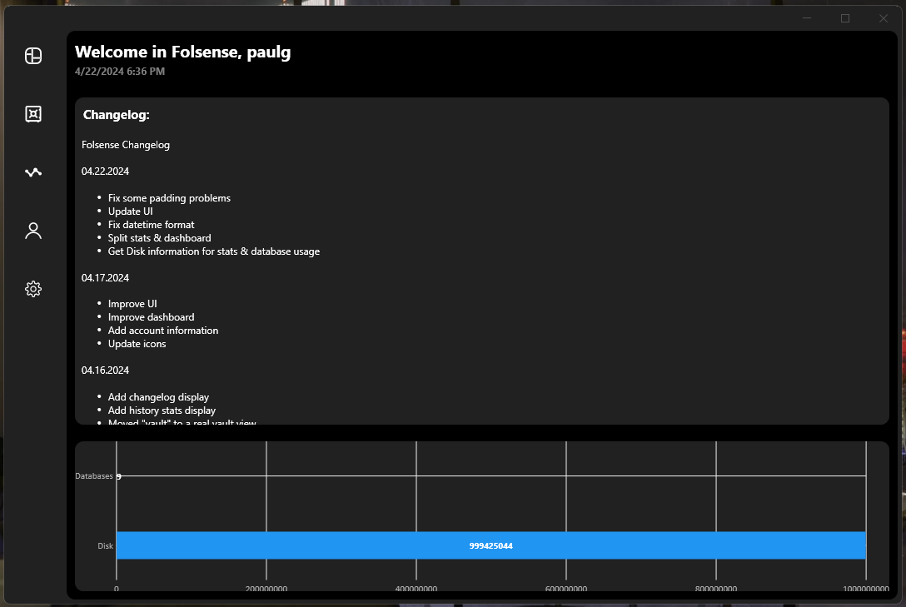
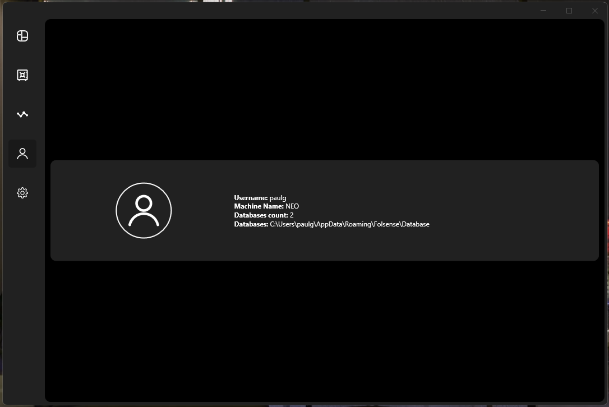
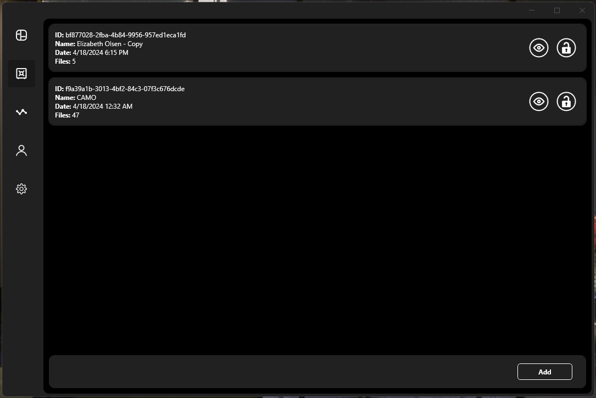

# Folsense

| | |
|:-------------------------:|:-------------------------:|
|||
|||

**IMPORTANT: MAKE SURE TO EDIT THE KEY IF YOU WANT TO REBUILD IT**
- Key: `Interfaces/Settings.cs`

**IF YOU DON'T WANT TO REBUILD IT, I WILL SET THE KEY EDITABLE IN COMMING RELEASES, MAKE SURE TO KEEP ANOTHER COPY OF THE FILE ENCRYPTED**

## Tasks
- [ ] User can edit the encryption key
- [ ] Unlock all after master key entered
- [ ] Manage Master key & hash
- [ ] Forward navigation
- [ ] Backward navigation

## Folsense Changelog

### 04.22.2024
- Fix some padding problems
- Update UI
- Fix datetime format
- Split stats & dashboard
- Get Disk information for stats & database usage

### 04.17.2024
- Improve UI
- Improve dashboard
- Add account information
- Update icons

### 04.16.2024
- Add changelog display
- Add history stats display
- Moved "vault" to a real vault view
- Improve UI
